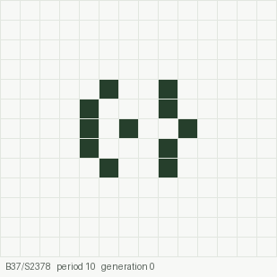
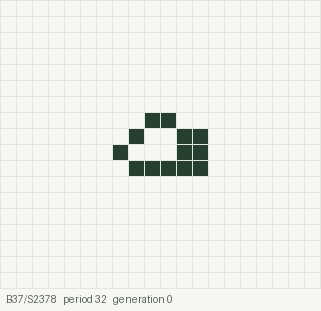
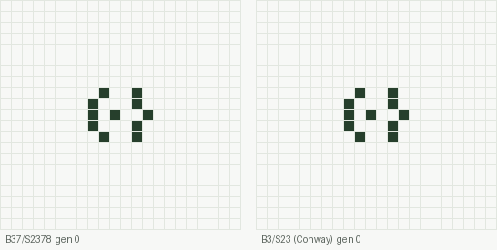
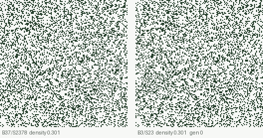
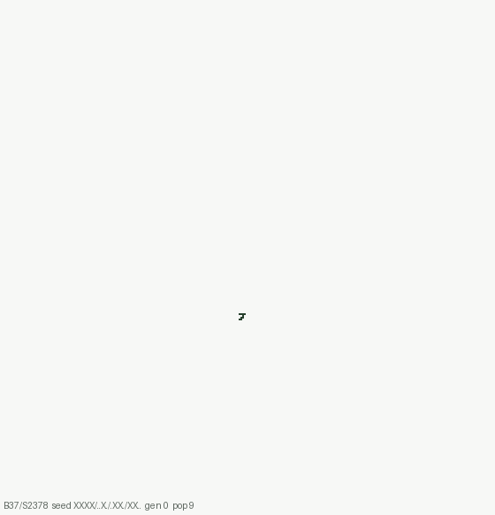

# The Life-like rule B37/S2378

[](https://doi.org/10.5281/zenodo.22974274)
[](https://github.com/joelcanary/life-like-rule-b37s2378/actions/workflows/ci.yml)
[](lean/)
[](LICENSE)
[](https://creativecommons.org/licenses/by/4.0/)

An exhaustive census of 4×4 seeds, disk-shaped growth, and two oscillators with
machine-checked periods — for the outer-totalistic rule **B37/S2378**: a dead
cell is born with 3 or 7 live neighbours, a live cell survives with 2, 3, 7 or 8.
It is a close relative of DryLife (B37/S23).

This repository holds everything behind the note
**[*The Life-like rule B37/S2378*](paper/b37s2378-census-note.pdf)**
(Joel Cruz Cabrera, 2026, [doi:10.5281/zenodo.22974274](https://doi.org/10.5281/zenodo.22974274), all versions):
the LaTeX source, the raw data, the code that produced it, the Lean 4 proofs and
the animations below. Every number in the note is generated from `data/` by a
script; none is typed by hand.

## Two oscillators Conway's rule does not have

<table>
<tr>
<td align="center"><br><b>p10</b>, 11 cells</td>
<td align="center"><br><b>p32</b>, 13 cells</td>
</tr>
</table>

Cells born in the current generation are drawn in teal. Both oscillators need
birth on 7: computed over their cycles, p10 works exactly in the rules from
B37/S238 to B378/S2378 and p32 from B37/S237 to B378/S2378
([`code/rango.py`](code/rango.py)). None of those six rules has a census on
Catagolue, and we found no earlier description of either oscillator.

```
#N p10 oscillator of B37/S2378 (11 cells)
x = 6, y = 5, rule = B37/S2378
bo2bo$o3bo$obo2bo$o3bo$bo2bo!

#N p32 oscillator of B37/S2378 (13 cells)
x = 6, y = 4, rule = B37/S2378
2b2o$bo2b2o$o3b2o$b5o!
```

The same 11 cells under B37/S2378 (left) and under Conway's B3/S23 (right):



### Machine-checked

[`lean/proofs/Lax834858Proofs/Oscillators.lean`](lean/proofs/Lax834858Proofs/Oscillators.lean)
proves, by kernel evaluation (`decide`, no `native_decide`):

| theorem | statement |
|---|---|
| `p10_period` | 10 steps of B37/S2378 return the p10 pattern to itself |
| `p10_period_minimal` | no smaller number of steps does |
| `p32_period` | 32 steps return the p32 pattern to itself |
| `p10_not_conway` | under B3/S23 the p10 pattern does not return within 10 steps |

`#print axioms` reports only `propext` for all four; CI checks it on every push with
[`lean/check_axioms.lean`](lean/check_axioms.lean).

The development follows the format of the Lax Lean Archive: [`lean/concepts/`](lean/concepts/)
*states* the four claims (declared there as `axiom`s, which is how the archive records a
statement) and [`lean/proofs/`](lean/proofs/) *proves* each one as a `theorem`, independently
of those declarations. The axiom audit confirms that no proof leans on them.

## Soups settle denser than in Conway's rule



Same random start (density 0.30, torus), both rules. Over 40 soups of side 128,
B37/S2378 settles at a density of **0.122** against **0.052** for B3/S23.

## Seeds that do not settle grow as a disk



Of 471 sampled unsettled 4×4 seeds, 338 are still growing after 1,000
generations; under Conway's rule none of 465 keeps growing. The growth is a disk
whose core holds the density of settled soup (0.111–0.130) and whose edge
advances at 0.056–0.065 cells per generation, shedding gliders.

## The census

Every one of the 51,472 seeds whose bounding box is exactly 4×4, evolved until it repeats
up to translation, for both rules (the other 14,063 non-empty patterns of the box are
translates of seeds of smaller boxes):

| class | B37/S2378 objects | occurrences | B3/S23 objects | occurrences |
|---|--:|--:|--:|--:|
| still life | 66 | 27,917 | 55 | 22,676 |
| oscillator, p = 2 | 26 | 9,000 | 24 | 7,972 |
| oscillator, p = 3 | 1 | 24 | 1 | 48 |
| oscillator, p = 10 | 1 | 8 | – | – |
| oscillator, p = 32 | 1 | 8 | – | – |
| spaceship, p = 4 (glider) | 1 | 752 | 1 | 728 |

Objects are counted up to symmetry and phase; cells within Chebyshev distance 3
belong to the same object.

## Repository layout

| folder | contents |
|---|---|
| [`paper/`](paper/) | the note (PDF and LaTeX), the generated table, figures and numeric macros, `datos_nota.py` that generates them, RLE files |
| [`data/`](data/) | JSON outputs of every computation |
| [`code/`](code/) | the scripts that produced `data/`, `rango.py` (rule ranges) and `animaciones.py` (the GIFs above) |
| [`lean/`](lean/) | the Lean 4 development (`concepts/` and `proofs/`) |
| [`animations/`](animations/) | the GIFs, regenerated by `code/animaciones.py` |
| [`tests/`](tests/) | unit tests (Python `unittest`) |
| [`.github/workflows/`](.github/workflows/) | CI: tests, regeneration, LaTeX build, Lean build and axiom audit |

Identifiers and comments inside `code/` are in Spanish; the note and this README are in English.

## Tests

```sh
pip install -r requirements.txt
python -m unittest discover -s tests -v
```

26 tests, a few seconds. They check:

- **the method against Conway's rule first**: block and beehive are still lifes, blinker and
  toad have period 2, the glider is a period-4 diagonal spaceship, the R-pentomino has not
  settled by generation 100;
- **the two oscillators**: periods 10 and 32, p10 not periodic under B3/S23, every rule in
  the computed range sustains p10 and dropping B7 breaks it;
- **the Lean encoding against the Python one**: the boards in the Lean files crop to the
  census oscillators, the pattern never reaches the board's border during its cycle, and the
  proofs contain no `sorry`, `native_decide`, `admit` or `axiom`;
- **the data**: the census evolved exactly the 51,472 seeds whose bounding box is 4×4 and
  every one of them is accounted for, periods 10 and 32 occur only
  in B37/S2378, the growth classes add up to the sample;
- **the note**: the RLE files decode to the census patterns, `cifras.tex`, the table and the
  RLE files regenerate identically from `data/`, and no generated value is typed by hand in
  `nota.tex`.

[CI](.github/workflows/ci.yml) runs them on every push, regenerates the note's numbers from
`data/`, compiles the LaTeX, builds the Lean proofs against the pinned Mathlib and audits their
axioms.

## Reproduce

Python 3.12 with the versions pinned in [`requirements.txt`](requirements.txt); a LaTeX
distribution for the note; Lean `v4.33.0` for the proofs. With those versions the figures and
the GIFs regenerate byte for byte; the numbers do not depend on library versions.

```sh
# the note: numbers, table and figures from data/, then LaTeX
cd paper && python datos_nota.py && pdflatex nota.tex && pdflatex nota.tex

# the animations (a few seconds on one core)
cd code && python animaciones.py

# the proofs
cd lean/proofs && lake exe cache get && lake build
```

Recomputing `data/` from scratch (the 4×4 census takes about 20 minutes on one core):

```sh
cd code
python censo_b37.py 4 4 --gens 100 --sopas 40
python censo_b37.py 4 4 --gens 100 --sopas 40 --regla B3/S23
python crecimiento.py 4 4 --regla B37/S2378 --gens 100 --lejos 1000 --muestra 25
python crecimiento.py 4 4 --regla B3/S23 --gens 100 --lejos 1500 --muestra 20
python lejos.py --regla B37/S2378 --de ../data/crecimiento-b37-s2378-4x4.json --lejos 5000 --muestra 34
python lejos.py --regla B3/S23 --de ../data/crecimiento-b3-s23-4x4.json --lejos 20000
python frente.py '["XXXX","..X.",".XX.","XX.."]' 1600 2400 frente-1.json
python rango.py
```

Outputs are written next to the scripts; move them to `data/` to rebuild the note from them.

## Cite

```bibtex
@misc{cruzcabrera2026b37s2378,
  author    = {Cruz Cabrera, Joel},
  title     = {The Life-like rule {B37/S2378}: an exhaustive census of $4\times4$ seeds,
               disk-shaped growth, and two oscillators with machine-checked periods},
  year      = {2026},
  publisher = {Zenodo},
  doi       = {10.5281/zenodo.22974274},
  url       = {https://doi.org/10.5281/zenodo.22974274}
}
```

GitHub's "Cite this repository" button reads [`CITATION.cff`](CITATION.cff).

## Corrections

**v2 (26 September 2026).** Version 1 of the note said the census evolved all 65,535
non-empty patterns of the 4×4 box. It evolves the 51,472 whose bounding box is exactly 4×4;
the other 14,063 are translates of smaller seeds and are skipped on purpose. The share of
unsettled seeds is therefore 22.8 % (B37/S2378) and 18.0 % (B3/S23), not 17.9 % and 14.2 %.
Every object, oscillator, table entry and growth figure is unchanged.
[`code/completa_censo.py`](code/completa_censo.py) adds the exact count to the census files
and `censo_b37.py` now writes it. Found while porting the census to C for the 5×5 box.

## Licences

Code and Lean development: [Apache License 2.0](LICENSE).
The note (PDF and LaTeX source in `paper/`) and the animations:
[Creative Commons Attribution 4.0](https://creativecommons.org/licenses/by/4.0/).

The computations, scripts and a first draft of the note were prepared with the
help of an AI assistant (Claude, Anthropic); the author reviewed the results and
is responsible for the content.
